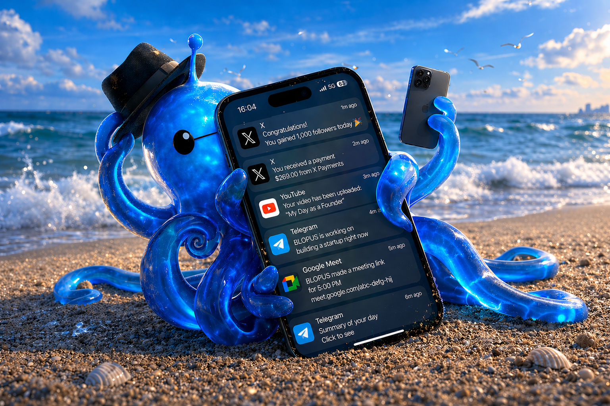
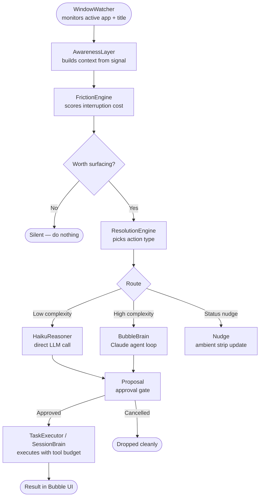
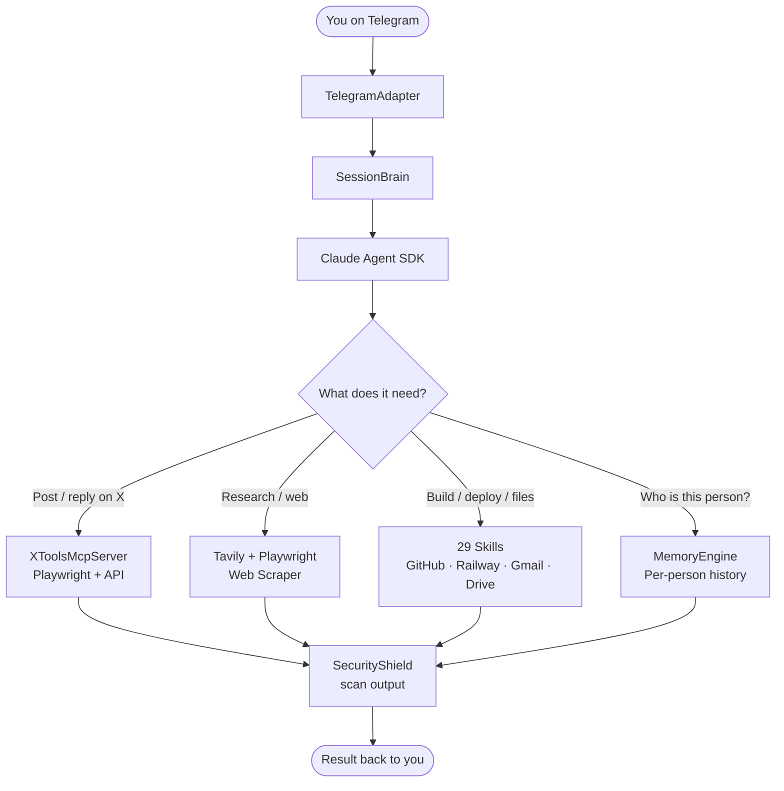
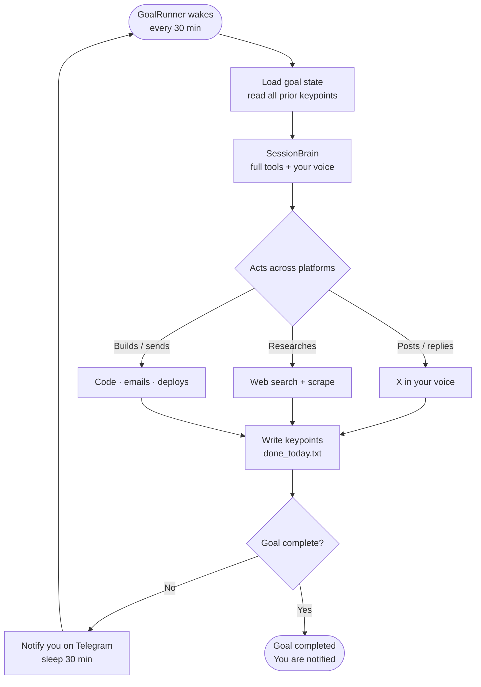
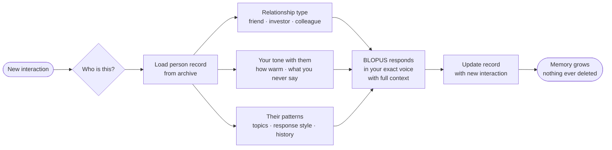

# BLOPUS Bubble

<p align="center">
  
</p>

[](https://github.com/ShoryaDs7/BLOPUS/stargazers)
[](LICENSE)

**BLOPUS is not a chatbot. It is a continuously running behavioral runtime that reads your environment, models your cognitive state, and decides whether to act — before you ask.**

It sits on your screen. Watches what you're doing. Understands your mental state. And when something genuinely matters, it surfaces a decision — not a notification, not a chat prompt, not a suggestion box. A concrete action, ready to approve or cancel.

| Tool | What it is | When it acts |
|------|-----------|--------------|
| GitHub Copilot | Code autocomplete | When you stop typing |
| ChatGPT Desktop | Reactive assistant | When you open it |
| Raycast AI | Command launcher | When you trigger it |
| **BLOPUS Bubble** | **Continuous behavioral runtime** | **Before you ask** |

---

## Two Modes

### Bubble Mode — ambient intelligence layer for your desktop

```bash
npm run blopus:bubble
```

A small glass UI lives at the corner of your screen. You never open it. It watches your windows, reads your context, and decides. When a proposal surfaces, you see it. One click runs it. One click cancels it. Every action goes through an approval gate — nothing executes without your confirmation.

### Autonomous Mode — your voice, running while you're offline

```bash
npm run blopus:owner
```

Posts on X in your exact writing style. Defends your replies. Tracks what matters. Long-running goals wake every 30 minutes and continue where they left off. Control everything from Telegram.

---

## How Bubble Works

BLOPUS Bubble is not an AI that waits for you to type. It is an event-driven pipeline — every action is triggered by a real signal from your environment.



**Every layer has a single job. No layer reaches past the next one.**

### Three input streams

The pipeline has three independent signal sources feeding AwarenessLayer simultaneously:

**WindowWatcher** — polls every 500ms via PowerShell + Win32 `GetForegroundWindow`. Uses UIAutomation to read the actual browser address bar URL, not the tab title. Fires `WindowContext { label, fullUrl }` on every change.

**VS Code / Cursor extension** — `POST /vscode` with event type `edit_loop` (same file opened 3+ times), `error` (diagnostic appeared), or `terminal_fail` (command exited non-zero). Two signals within 5 minutes triggers the code path. `terminal_fail` fires immediately on the first hit.

**Browser extension** — `POST /browser` with either `selection` (text the user highlighted + page keywords) or `page_load` (full page content on navigation). Feeds compose-surface awareness and topic context.

### Signal processing

AwarenessLayer extracts a clean topic from every window change:

- Strips noise from titles: `"how to"`, `"what is"`, `"[D]"`, `"vs"` prefixes, Reddit/YouTube suffixes
- Platform-specific regex for YouTube (`- YouTube`), Google Search, Bing, Reddit threads (`r/sub`), subreddits, arXiv, GitHub, generic articles
- Detected platforms: `youtube` / `google` / `bing` / `reddit` / `github` / `arxiv` / `web`
- Maintains a rolling 30-minute timeline of every page visited

Patterns detected over the timeline:
- `cross_site` — same topic on 2+ different platforms
- `repeated` — 3+ hits on the same topic within 30 minutes
- `deep_read` — 4+ minutes dwell time AND a prior visit to the same page

---

## Ambient vs Intentional Intelligence

BLOPUS Bubble operates in two cognitive modes simultaneously:

**Ambient Intelligence** — you never prompt it. It watches. WindowWatcher detects your active window every second. AwarenessLayer builds a picture of what you're doing. FrictionEngine decides if interrupting you is worth it. Most signals are dropped silently. Only actions that cross the friction threshold reach your screen.

**Intentional Intelligence** — you want it. Click the chat area, type a message, or paste a screenshot. SessionBrain routes your request through the full Claude agent loop with tool access. Vision button gives instant image analysis via a single Haiku call — no agent startup, result in seconds.

Both modes share the same execution layer. The intelligence is in the routing.

---

## Human-State Modeling

Before proposing anything, BLOPUS reads your cognitive state — not just your window title.

FrictionEngine scores every signal into a named state with a calibrated confidence:

| State | Trigger | Confidence |
|-------|---------|-----------|
| `unresolved_exploration` | bouncing across 2+ platforms on the same topic | 0.82 |
| `confusion_loop` | 3+ topic hits in 30min | 0.70 – 0.95 (scales with count) |
| `prolonged_effort` | same topic for 15+ minutes | 0.75 |
| `rapid_switching` | high context churn, low dwell per window | 0.73 |
| `repeated_return` | exact same URL visited twice | 0.78 |

Platform diversity boosts confidence — hitting the same topic on YouTube, then Reddit, then arXiv pushes `unresolved_exploration` higher than hitting it three times on Google alone.

**For non-browser apps** (Notion, Gmail, Figma, PowerPoint, Zoom), WindowWatcher can't read URLs. A suspicion gate fires vision instead — scoring the session against known signals:

| Signal | Score |
|--------|-------|
| Known productive app detected | +0.30 |
| Dwell > 3 minutes | +0.25 |
| Dwell > 8 minutes | +0.15 |
| 4+ window switches | +0.20 |
| 7+ window switches | +0.10 |

Threshold: **0.50** — below it, nothing happens. Above it, a screenshot is taken and analyzed.

**Independent cooldowns** — each layer owns its own timer. They never block each other:

| Layer | Cooldown |
|-------|---------|
| Awareness nudge | 4 min |
| Friction insight | 6 min |
| BubbleBrain deep answer | 10 min |
| Proposal card (per topic + action) | 5 min |

---

## The Router Is the Moat

Most AI tools compete on which model they use. BLOPUS competes on what it decides to do and when.

ResolutionEngine classifies every friction signal into a gap type using regex — no LLM involved:

| Gap type | Keywords |
|----------|---------|
| `concept_boundary` | "vs", "difference", "compare", "which" |
| `definition_gap` | "what is", "definition", "explain", "meaning" |
| `implementation_gap` | "how to", "error", "fix", "debug", "example" |
| `intuition_gap` | 2+ platforms including YouTube |
| `general` | everything else |

Gap type determines which of three paths fires — simultaneously, racing:

**Orchestrator** (~12s timeout) — builds a gap-targeted Tavily query, calls Haiku with the search results, returns 2–3 sentences. Fast, specific, no agent loop.

**BubbleBrain** — direct Anthropic API loop, no agent SDK, no MCP servers. Tools available: `web_fetch`, `tavily_search`, `read_file`, `bash_command` (read-only), `save_insight`, `read_insights`, `open_url`, `gmail_unread`. Saves findings to `bubble_insights.jsonl`. Returns an empty string if it can't form a real diagnosis — never hallucinates a proposal.

**Nudge** — one sentence, 10–16 words hard limit. Two types: awareness nudge (surfaced from AwarenessLayer before friction fires) and friction nudge (after FrictionEngine scores the state). If the sentence isn't worth saying, outputs `SKIP` and stays silent.

First path to return a real answer wins. The other two are discarded.

**HaikuReasoner** — before any path fires, classifies the intent into one of nine types:

`build` / `debug` / `compare` / `synthesize` / `draft` / `prepare` / `automate` / `learn` / `silence`

Generates a specific proposal label ("Want me to build a burn rate calculator?") and a confidence score. Confidence below 0.65 → silence, nothing shown. Maps intent to the right runner: `build`, `debug`, `draft`, `prepare`, `automate` → SessionBrain. `synthesize`, `learn` → TaskExecutor.

**ActionRouter** — rule-based, no LLM. Maps `(topic + gap + pattern + surface)` to one of 13 action types:

`find_video` · `find_article` · `find_discussion` · `find_resource` · `draft_tweet` · `compare_options` · `synthesize_research` · `debug_code` · `generate_content` · `draft_email` · `improve_doc` · `meeting_prep` · `summarize_doc`

Builds a full `TaskEnvelope` — goal, allowed tools, tool budget, max turns, max tokens, timeout, return format — before anything executes. Vision surfaces route by detected `activity` (what the user is doing), not by app name.

---

## Execution Boundaries

BLOPUS never runs unconstrained. Every task that enters the execution layer runs inside a bounded envelope:

- **Approval gates** — nothing executes without explicit user confirmation on the proposal card
- **Runtime caps** — tasks have maximum execution time, enforced by AbortController
- **Tool budgets** — each task specifies which tools it can use and how many calls
- **Cancellation** — stop button kills the in-flight fetch and signals the agent to halt immediately
- **Scoped envelopes** — TaskExecutor and SessionBrain each have separate scopes; a chat task and a proposal task can run simultaneously without interfering

These are not safety features added afterward. They are the architecture. BLOPUS is designed to be stoppable at every layer.

---

## Universal Detection. Separated Executor.

Four layers. Each isolated:

1. **Detection** — WindowWatcher + AwarenessLayer. Reads signals. Builds context. Has no execution capability.
2. **Friction** — FrictionEngine + ResolutionEngine. Scores and routes. Has no execution capability.
3. **Intelligence** — HaikuReasoner + BubbleBrain. Reasons about context. Proposes actions. Does not execute.
4. **Execution** — TaskExecutor + SessionBrain. Executes approved actions. Cannot propose. Cannot gate.

This separation means: a detection bug cannot cause an accidental action. An intelligence bug cannot bypass an approval gate. An execution bug cannot surface a false proposal. Each layer fails in its own lane.

**ActivityContext** blocks execution based on what you're doing — not who's asking:

| Activity | Allowed actions |
|----------|----------------|
| `research` | find_article, find_video, find_discussion, find_resource, summarize_page, compare_options, synthesize_research |
| `coding` | find_resource, debug_code only |
| `writing` | draft_tweet, generate_content only |
| `watching` / `communication` / `browsing` | nothing — all proposals blocked |

**VS Code path** — a separate lane that bypasses Orchestrator entirely. Needs 2+ code signals within 5 minutes. `terminal_fail` fires immediately on the first hit without waiting for the threshold. Goes direct to BubbleBrain. Only surfaces a proposal if BubbleBrain returns a real answer — empty string means silence.

**IntentEngine** — watches compose surfaces across Gmail, X, LinkedIn, Reddit, Outlook, Notion, Slack. When the browser extension detects a 300ms pause mid-draft, IntentEngine pre-computes a sharper version in the background. On hover over Send, it appears as a ghost suggestion. On send click, it can auto-inject. Results cached 60 seconds per compose surface.

**Vision flow** — when the suspicion gate crosses 0.50 on a non-browser app, `structuredScan()` takes a screenshot (bubble hides via opacity 0 + 180ms compositor flush so it's never in the image), runs a single Haiku call returning structured JSON (`surface`, `activity`, `intent`, `friction`, `confidence`, `contextSnippet`), then ActionRouter routes on the detected activity. Total time: ~5 seconds. The manual vision button in the chat bar follows the same path.

**Bubble UI** — Electron window, always-on-top, frameless, transparent. 320px wide. Collapses to a 52px pill. Drag anywhere on screen — position persists. Double-ESC resets to the bottom-right corner. Pulsing dot indicates a new message or active task. Ghost suggestions are injected directly into compose boxes via the browser extension content script.

---

## What it is

- **It sounds like you:** trained on 2000+ of your real replies, patterns, tone, writing style. Every output grounded in how you actually think. Tweets in your Twitter voice. Emails and GitHub comments in your professional voice — writing mechanics auto-derived from your archive during setup. It knows the difference.

- **It knows everyone you know. And how you are with each of them.** Before responding to anyone, it reads your full history with them. Your tone with them specifically. What you never say to them. Their patterns too.
- **It never forgets:** goals run for days or weeks. Every 30 minutes it wakes, reads everything it decided before, and continues. Day 30 still knows what it ruled out on Day 1.
- **It operates your real accounts:** posts, replies, quote-tweets, defends hostile replies on X. In your voice. While you're offline.
- **BLOPUS does what you would have done.** Writes, replies, builds, deploys, researches and anything else you'd do yourself. One Telegram message away.
- **Multi-platform:** X (live), Telegram control (live), Reddit and Discord next.
- **Per-creator isolation:** multiple identities on one machine, each with its own keys, archive, voice, and memory.

---

## Quick start

Requires [Node.js](https://nodejs.org) 18+ and [Python](https://python.org) 3.8+.

**npm run setup** walks you through everything: API keys, archive upload, voice modeling, behavior config.

```bash
git clone https://github.com/ShoryaDs7/BLOPUS.git
cd BLOPUS
npm install          # handles all 29 skill dependencies
npm run setup

# Bubble Mode — ambient intelligence layer on your desktop (main)
npm run blopus:bubble

# Autonomous Mode — Telegram control + X posting while you're offline
npm run blopus:owner
```

---

## API Keys

**npm run setup** handles all of this interactively. Expand only if you want to know what's needed upfront.

<details>
<summary>Required keys — nothing works without these</summary>

| Key | What |
|-----|------|
| `ANTHROPIC_API_KEY` | core intelligence |
| `TWITTER_API_KEY/SECRET` + `ACCESS_TOKEN/SECRET` | X API (free tier works) |
| `X_AUTH_TOKEN` + `X_CT0` | X session cookies for home timeline |
| `TELEGRAM_BOT_TOKEN` + `TELEGRAM_OWNER_CHAT_ID` | control interface |

</details>

<details>
<summary>Optional keys — unlocks more capabilities</summary>

| Key | What it unlocks |
|-----|---------|
| `TAVILY_API_KEY` | Real-time web search (free tier) |
| `GITHUB_TOKEN` | Repos, commits, PRs, issues from Telegram |
| `RAILWAY_TOKEN` | Deploy to Railway from Telegram |
| `GOOGLE_CLIENT_ID` + `GOOGLE_CLIENT_SECRET` | Gmail, Calendar, Drive, Docs, Sheets, Tasks, Contacts, Meet |

</details>

---

## Control via Telegram

One conversation. It controls everything.



### Social Memory

```
give me the full history with @naval —
who reached out first, what we talked about, who goes quiet more

→ you reached out first, march 2023.
  last exchange: you pushed back on his leverage take, he didn't reply.
  you initiate 3x more than he does.
```

### Autonomous Goals

```
track what my competitors are shipping every day and post my take

→ goal running. posting in your voice every day.
```

### Development

```
respond to every PR comment on my repo today

→ 14 comments. replied to all in your voice. 2 PRs merged.
```

### Build

```
build something that watches my competitor's pricing page,
alerts me the moment anything changes, and logs every version

→ built. deployed. watching 4 pages.
  logs in your drive. you'll know before their team announces it.
```

---

## Long-running goals

**Every AI agent forgets everything the moment a session ends. BLOPUS doesn't.**

Set a goal:

```
set a goal: repair and double down on my professional network

audit my last 2 years of DMs and emails to find 10 high-value
connections I've let go cold.

analyze why they went cold and draft a hyper-personalized
re-entry message in my current voice.

if they reply, handle the scheduling for a catch-up call
using my calendar.

find 5 new people in my space I should know, and start engaging
with their work on X the way I usually do — thoughtful pushback, no fluff.

don't stop until 10 cold connections are active again
with a confirmed response or scheduled meeting.
```

Every 30 minutes, `GoalRunner` wakes up, reads everything it knows, and does the next right thing.

Every future session reads everything before it.

**30 days in. BLOPUS still knows what it decided on day 1.**

Nothing resets.  
Nothing is forgotten.

After every session:

- what was permanently ruled out, never retried again
- decisions and findings that must carry forward
- the best open thread: where to push next

Dead ends stay dead. Progress compounds.

These goals now power both Bubble and the autonomous agent.



---

## Memory

Most AI has context. **BLOPUS has history.**



### Per-person memory

Before BLOPUS responds to anyone, it reads everything it knows about them.

Every contact has a live record, seeded from your archive, updated on every interaction:

- your relationship with them (friend, investor, colleague, unknown)
- your tone with them: how formal, how warm, what you never say to them
- **their** patterns: what they care about, how they respond, their tone and interests derived from both sides of every DM and conversation in your archive
- full interaction history going back years, nothing ever deleted

BLOPUS doesn't just know how you talk to someone. It knows the other person too.

### Telegram session memory

Your conversation context is always live within a session. Critical decisions, ongoing tasks, and open threads carry forward. BLOPUS picks up exactly where you left off, even weeks later.

### Global memory

Every action BLOPUS takes — every post, reply, quote-tweet, email sent, goal session run — is logged in a single cross-platform audit trail. Every post is marked: written by BLOPUS or written by you.

BLOPUS reads this log before every action. It never posts the same topic twice in a day. It never repeats itself across platforms. It knows exactly what it has done and what you have done.

Tracks topic performance over time: what gets engagement, what gets ignored, when to stop pushing a topic.

---

## Autonomous presence

BLOPUS stays active while you're offline, posting, replying, defending, engaging, all in your voice, derived from your real behavior. X is live today. Reddit and Discord are next.

```bash
npm run blopus:owner
```

---

## Skills

29 built-in capabilities. All 29 skills are shared between Bubble and Autonomous Mode.

| Category             | Skills |
|----------------------|--------|
| **BLOPUS-native**    | Post on X, browse web, read memory, long-running goals, edit BLOPUS's own code, security shield |
| **Development**      | Website builder, backend APIs, MCP tools, GitHub, deploy (Vercel / Railway / Netlify / Render) |
| **Web & Data**       | Web scraping, data analysis, SQLite, SEO |
| **Google Workspace** | Gmail, Calendar, Drive, Docs, Sheets, Tasks, Contacts, Meet |
| **Documents**        | PDF, Word, Excel, PowerPoint |
| **Media & Content**  | YouTube, image editing, video scripts, writing, resume, clinical notes |

**Custom Skills:** drop a `.md` file into `/skills` to teach BLOPUS something new.

---

## Security

BLOPUS acts as you. A hostile message that hijacks its behavior, or a credential leaked in something it sends, has real consequences.

Every incoming message is scanned before Claude sees it. Every outgoing action is scanned before it sends. Nothing leaks. Nothing gets hijacked. If anything trips, the action is dropped and you're notified on Telegram. Zero config. Protects both Bubble and the background agent.

```bash
npx tsx scripts/testSecurity.ts   # 50 adversarial tests — all must pass
```

---

## Multi-user

Every person who runs BLOPUS gets their own isolated folder:

```
creators/alice/   ← Alice's keys, archive, voice, memory
creators/bob/     ← Bob's keys, archive, voice, memory
```

> **Privacy-first isolation: nothing is shared between identities.**

**npm run setup** saves your name to `.env` automatically. Multiple identities, pass it per instance:

```bash
CREATOR=alice npm run blopus:bubble
CREATOR=bob npm run blopus:bubble
```

---

## Architecture

| Folder | What lives here |
|--------|----------------|
| [`bubble/`](bubble/) | Behavioral runtime: WindowWatcher, AwarenessLayer, FrictionEngine, ResolutionEngine, BubbleBrain, Orchestrator, TaskExecutor, Bubble UI |
| [`agent/`](agent/) | The always-on loop: autonomous posting, reply hunting, engagement, defense, GoalRunner |
| [`core/`](core/) | Intelligence: voice engine, memory, per-person profiles, RAG index |
| [`adapters/`](adapters/) | Platform connectors: X (Playwright + API), Telegram, SessionBrain, MCP tools |
| [`skills/`](skills/) | 29 markdown files, each one teaches BLOPUS a new capability |

---

MIT © 2026 ShoryaDs7

---

**There is always a version of you online.  
And it doesn't stop when you do.**

*"Built because I wanted to be in two places at once." — @shoryads7*
